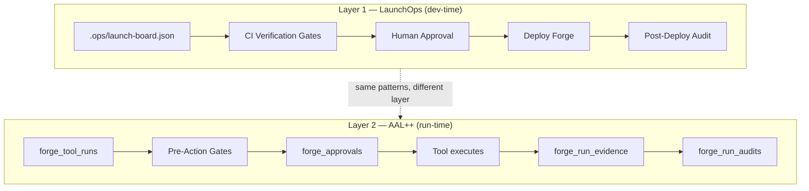
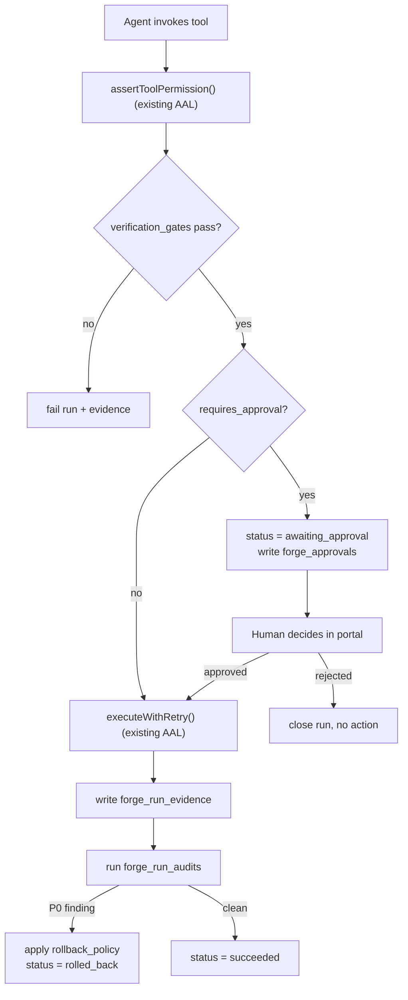

# Forge × LaunchOps — Integration Architecture

**How LaunchOps folds into Forge without disturbing what exists — and where it upgrades the runtime.**

Stack unchanged: Next.js 14 · TypeScript · Supabase · Inngest · Vercel.

---

## The core realization: LaunchOps maps to Forge at two layers

LaunchOps and Forge's Agent Authority Layer (AAL) are structurally the same idea — a typed state machine with evidence, gates, approvals, and audit loops. But they govern two different things:

| | Governs | Actor | Lifecycle unit |
|---|---|---|---|
| **LaunchOps** | How Forge itself gets shipped | Humans + CI | A `blocker` moving to "shipped with evidence" |
| **Forge AAL** | How Forge's agents run for clients | AI agents | A `forge_tool_run` moving to "executed with recovery" |

They are **not** the same table and must not be merged. But LaunchOps's *patterns* — evidence, approval gates, rollback, post-hoc audit — are exactly what AAL is missing at runtime. So the integration is two moves:

1. **Layer 1 — Adopt LaunchOps as-is** as the build/release OS for shipping Forge. Product-agnostic, drops in at the repo root, governs phase-by-phase delivery. Near-zero changes.
2. **Layer 2 — Port LaunchOps patterns down into the AAL runtime**, using Forge naming, extending existing tables. This is the strategically valuable move — it deepens the YC #12 story (*machine-native paths, permissions, and recovery*).



---

## Concept-by-concept mapping

What already exists in Forge, what LaunchOps extends, and what's net-new.

| LaunchOps concept | Forge today | Verdict | Layer |
|---|---|---|---|
| Blocker state machine | `forge_tool_runs.status` (pending→running→retrying→succeeded/failed) | **Keep separate.** Dev blockers ≠ runtime tool runs. Different lifecycles. | — |
| Launch board | Roadmap phases (HTML) + AAL 3-week plans | **Formalize** into `.ops/launch-board.json` | 1 |
| Evidence model | `forge_tool_runs.output` + audit log ("actions traceable") | **Extend** → typed, durable, referenced evidence | 2 |
| Human approval gates | AAL permission levels (read/execute/admin) | **Compose, don't replace.** AAL gates *which agent*; approval gates *whether a human signed off* | 2 |
| Verification gates | CI (implied), none at runtime | **Add** both: real CI gates (L1) + pre-action gates (L2) | 1 + 2 |
| Rollback architecture | `executeWithRetry()` (redo only) | **Add rollback (undo).** Retry ≠ rollback | 2 |
| Post-deploy audit loop | none | **Add** at both layers | 1 + 2 |
| Environment contract | `.env.local.example` | **Upgrade** to fail-closed contract | 1 |
| Deployment pipeline | `vercel --prod` (manual) | **Formalize** with gates + audit | 1 |

**The one thing not to do:** do not collapse LaunchOps's 10-state blocker lifecycle into `forge_tool_runs`. They look similar and are not. A dev blocker is reviewed and merged by humans; a tool run is retried and checkpointed by the engine. Keep both. They rhyme; they don't unify.

---

## Layer 1 — LaunchOps as Forge's build/release OS

Adopt LaunchOps almost verbatim. It governs how each Forge phase ships. Lanes map to phases; blockers map to phase deliverables; evidence gates guard every deploy.

### Repository structure (merged, additive)

Everything under `.ops/`, `docs/`, `.github/`, and `scripts/` is **new**. Nothing under `src/` or `supabase/` is touched by Layer 1.

```text
forge-agent/
├── .ops/                          ← NEW (LaunchOps L1)
│   ├── launch-board.json
│   ├── launch-board.schema.json
│   └── launch-status.mjs
├── docs/                          ← NEW
│   ├── LAUNCH_OPS_ARCHITECTURE.md
│   ├── ENVIRONMENT_CONTRACT.md
│   ├── RELEASE_RUNBOOK.md
│   └── ROLLBACK_RUNBOOK.md
├── .github/workflows/             ← NEW
│   ├── ci.yml                     (typecheck, lint, test, build, secret-scan, env-validate)
│   ├── deploy-production.yml
│   └── post-deploy-audit.yml
├── scripts/                       ← NEW
│   ├── validate-launch-board.mjs
│   ├── validate-env.mjs
│   └── check-release-gates.mjs
├── src/                           ← UNCHANGED (Forge app)
├── supabase/migrations/           ← UNCHANGED by L1
├── forge.json                     ← UNCHANGED (AAL manifest)
└── package.json
```

### Lanes = Forge phases

The single-active-lane policy maps perfectly to your phase discipline — you ship one phase at a time. Seeded board (see `forge-launch-board.json`) starts with **Phase 00** active and its scaffold checklist as blockers.

```text
launch-readiness      → the phase currently shipping (Phase 00 now)
security-readiness    → RLS + AAL permission audits
migration-readiness   → every Supabase migration
observability-readiness → PostHog + Sentry live
oss-readiness         → Phase 05 public launch gates
```

### Environment contract upgrade

Your Phase 00 `.env.local.example` becomes a fail-closed contract. This matters more for Forge than a generic app because you carry secrets through Phase 08 (Stripe, Anthropic, Supabase service role, Inngest signing key).

```md
## Server (fail closed in production)
- SUPABASE_SERVICE_ROLE_KEY: required, server-only. App refuses to boot if missing in prod.
- ANTHROPIC_API_KEY: required for agent runtime.
- INNGEST_SIGNING_KEY: required in production.
- STRIPE_WEBHOOK_SECRET: required once billing is live (Phase 03).

## Public (must never contain secrets)
- NEXT_PUBLIC_SUPABASE_URL, NEXT_PUBLIC_SUPABASE_ANON_KEY, NEXT_PUBLIC_APP_URL

## Dev only (impossible in production)
- AUTH_DISABLED=true  → hard-fail if set while NODE_ENV=production
```

---

## Layer 2 — LaunchOps patterns extend the AAL runtime

This is where the integration earns its keep. Forge's agents run long, side-effectful workflows for clients (publish posts, respond to reviews, eventually spend ad budget). LaunchOps's evidence / approval / rollback / audit model is exactly the governance an agent runtime needs — and AAL doesn't have it yet.

All of this **extends** existing AAL tables. Nothing is renamed.

### Extend `forge_tool_runs` status

```sql
-- Existing: pending | running | retrying | succeeded | failed
-- Add two LaunchOps-inspired states:
ALTER TYPE ... -- (recreate enum or use text check)
--   awaiting_approval   → run paused at a human approval gate
--   rolled_back         → run was undone after completion
```

### Extend `forge_tools` with gate + rollback metadata

```sql
ALTER TABLE forge_tools
  ADD COLUMN requires_approval   BOOLEAN NOT NULL DEFAULT false,
  ADD COLUMN approval_action_type TEXT,        -- publish_content | ad_spend | review_response | send_email | data_deletion
  ADD COLUMN verification_gates  JSONB NOT NULL DEFAULT '[]',  -- pre-execution checks
  ADD COLUMN rollback_policy     JSONB;         -- how to undo this tool's effect
```

This maps LaunchOps's "approval-required blocker types" and "rollback architecture" directly onto the tool registry. A `publish_content` tool now declares `requires_approval: true` and a `rollback_policy`; a `generate_report` tool declares neither.

### New table: `forge_run_evidence` (mirrors LaunchOps evidence model)

Forge logs that an action happened. LaunchOps demands *durable, inspectable, referenced* proof. Applied to agents, this becomes a client-auditable trail — every post published, every review answered, with a reference.

```sql
CREATE TABLE forge_run_evidence (
  id          UUID PRIMARY KEY DEFAULT gen_random_uuid(),
  run_id      UUID REFERENCES forge_tool_runs(id) ON DELETE CASCADE,
  kind        TEXT NOT NULL,      -- output | api_response | published_url | screenshot | metric | approval | rollback
  description TEXT NOT NULL,
  reference   TEXT,               -- URL, external post ID, storage path — durable + inspectable
  created_at  TIMESTAMPTZ DEFAULT now()
);
CREATE INDEX idx_run_evidence_run ON forge_run_evidence(run_id);
```

LaunchOps's "bad evidence" rule (`Looks good`, `Probably fixed`) becomes a runtime constraint: no evidence row without a `reference` for kinds that can carry one.

### New table: `forge_approvals` (mirrors LaunchOps approval gates)

Composes *with* AAL permissions — it does not replace them. AAL answers "can this agent call this tool?" Approval answers "did a human sign off on this specific high-risk action?"

```sql
CREATE TABLE forge_approvals (
  id           UUID PRIMARY KEY DEFAULT gen_random_uuid(),
  run_id       UUID REFERENCES forge_tool_runs(id) ON DELETE CASCADE,
  agent_id     UUID REFERENCES forge_agents(id),
  action_type  TEXT NOT NULL,     -- matches forge_tools.approval_action_type
  status       TEXT NOT NULL DEFAULT 'pending',  -- pending | approved | rejected | expired
  requested_at TIMESTAMPTZ DEFAULT now(),
  decided_by   UUID REFERENCES auth.users(id),
  decided_at   TIMESTAMPTZ,
  notes        TEXT,
  expires_at   TIMESTAMPTZ
);
CREATE INDEX idx_approvals_status ON forge_approvals(status, run_id);
```

Runtime flow: when a tool with `requires_approval = true` is invoked, `executeWithRetry` sets the run to `awaiting_approval`, writes a `forge_approvals` row, and suspends. The client portal (Phase 03) surfaces pending approvals. On approval, Inngest resumes the run from its checkpoint — which is exactly what AAL's resume engine already does.

### New table: `forge_run_audits` (mirrors LaunchOps post-deploy audit)

After an agent completes a workflow, a read-only audit verifies it behaved. This is the trust layer that lets you tell a client — and YC — that the agent is not just running, but *verified*.

```sql
CREATE TABLE forge_run_audits (
  id          UUID PRIMARY KEY DEFAULT gen_random_uuid(),
  run_id      UUID REFERENCES forge_tool_runs(id) ON DELETE CASCADE,
  status      TEXT NOT NULL,      -- succeeded | needs_attention | failed
  summary     TEXT NOT NULL,
  findings    JSONB NOT NULL DEFAULT '[]',   -- blocking findings, P0→failed / P1→needs_attention
  created_at  TIMESTAMPTZ DEFAULT now()
);
```

LaunchOps's severity mapping ports directly: a P0 audit finding fails the run and can trigger the `rollback_policy`; P1 flags it for human review in the portal.

### The extended runtime loop



Everything in the existing-AAL boxes is already built. Layer 2 is the gates, approvals, evidence, audit, and rollback wrapped around it.

---

## What's net-new vs. reused

| | New in this integration | Reused from AAL |
|---|---|---|
| Permission gate | — | `assertToolPermission()` |
| Retry + checkpoint | — | `executeWithRetry()`, `saveCheckpoint()` |
| Resume-from-checkpoint | — | Inngest `forgeToolRunner` |
| Manifest discovery | — | `forge.json` / `/api/forge/manifest` |
| Verification gates | ✓ | — |
| Approval gates | ✓ | composes with AAL levels |
| Typed evidence | ✓ | extends audit log |
| Rollback (undo) | ✓ | — |
| Post-execution audit | ✓ | — |
| Dev-time launch board | ✓ (Layer 1) | — |

Three new tables (`forge_run_evidence`, `forge_approvals`, `forge_run_audits`), three new columns on `forge_tools`, two new run states. No renames, no breaking changes, no new services.

---

## Roadmap sequencing

LaunchOps lands in two places, and they don't wait for each other:

- **Layer 1 starts now.** It's product-agnostic and governs Phase 00 shipping itself. Seed `.ops/launch-board.json` with the Phase 00 checklist, add the CI workflow, write the environment contract. This is a half-day of setup that pays off every phase after.
- **Layer 2 lands with Phase 02.5 (AAL).** It's a direct extension of the AAL tables, so build it in the same phase — AAL Week 2 (recovery) is the natural home for evidence + rollback, and Week 3 for approvals + audit. Update the AAL spec's 3-week plan to fold these in rather than treating them as a later phase.

```text
Phase 00 (now)     → Adopt LaunchOps Layer 1. Board + CI + env contract.
Phase 02.5 (AAL)   → Build Layer 2 into the runtime alongside permissions/retry/manifest.
Phase 03 (Portal)  → Surface pending forge_approvals + audit results in the client UI.
Phase 05 (OSS)     → Ship the whole governance model as part of the OSS story.
```

---

## Why this strengthens the YC #12 story

YC #12 asks for *machine-native paths, permissions, and recovery*. AAL alone covers paths (manifest), permissions (scoping), and basic recovery (retry). LaunchOps Layer 2 closes the gap between "retry" and real **recovery**:

- **Evidence** → every agent action is provable, not just logged
- **Approval gates** → high-risk agent actions have human-in-the-loop control, the exact pattern serious agent infra needs
- **Rollback** → agents can *undo*, not just *redo*
- **Post-execution audit** → agents are verified, not trusted blindly

That's the difference between "an agent that runs tools" and "agent infrastructure a Fortune 100 would let near their marketing." It's also a clean answer to the classic YC probe — *"what happens when your agent does something wrong?"* Now you have one: it hits a gate, produces evidence, gets audited, and rolls back.
